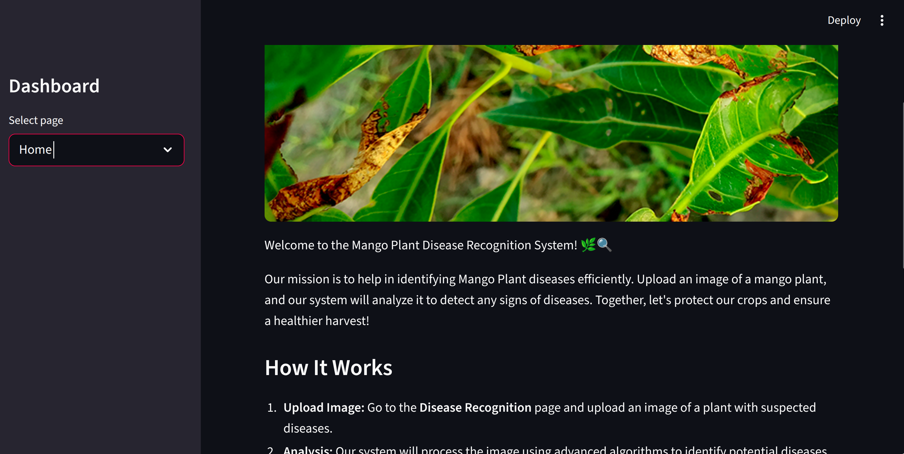
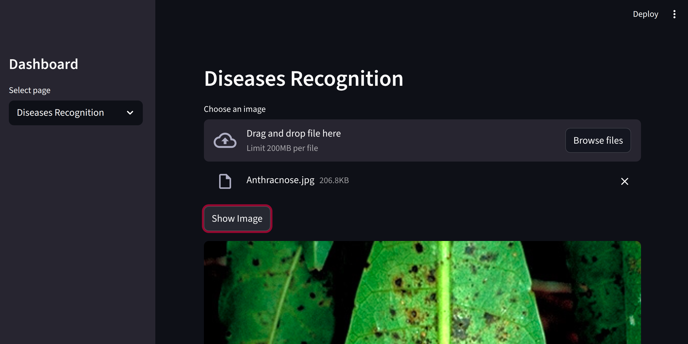
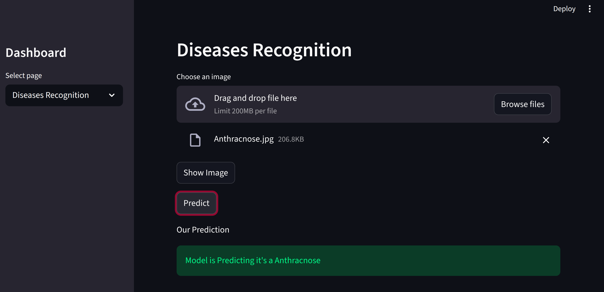

# Mango_leaf_diseases_prediction

Welcome to the Mango Plant Disease Recognition System! 🌿🔍
- Our mission is to help in identifying Mango Plant diseases efficiently. Upload an image of a mango plant, and our system will analyze it to detect any signs of diseases. Together, let's protect our crops and ensure a healthier harvest!

## Features
- Upload leaf images and get real-time disease prediction

- Trained using CNN with high validation accuracy

- Clean and simple Streamlit UI

- Supports 8 disease classes

- Uses .keras model for efficient inference


## Technologies/tools used
- Python

- Tensorflow

- Matplotlib

- Numpy

- Streamlit

- Keras

- Json

- Sklearn

- Seaborn

- Deep Learning (CNN)

- Jupyter Notebook

## Steps to install & run the project

Step 1: Install Python

- Go to the official Python website:

- https://www.python.org/downloads

- Download the latest version (it will say “Download for Windows/Mac”).

- Install it by clicking Next → Next → Install.

- IMPORTANT: Make sure you tick the box “Add Python to PATH” before installing.

Step 2: Download Folder From github

- Download zip file from GitHub

- Extract the file wherever you want
        
Step 3: Download Dependencies

- Open the terminal 
    
- Nevigate to the folder in which you  have extracted the zip file
    
- run the command   
    ```bash
    pip install -r requirement.txt 
    ```
    
- it will download all the dependencies that are needed to run the Project

- Or you can download it manually

Step 4: Run Main file

- Nevigate to the Folder/Directory in Which you have Extracted the zip file

- run the command 
    ```bash
    streamlit run main.py
    ```

Wait for a few seconds.
A browser window will automatically open showing the Mango Leaf Disease Detection App.
if it does not open automatically, the terminal will show a link like:
it will show something like this in your terminal http://localhost:8501
copy and past it in your Browser 

## Instruction for testing 

- The app will open in your browser.

- Click Disease Recognition in the left sidebar.

- Click Upload Image.

- Select a mango leaf photo.

- Click Predict.

- The app will tell you which disease the leaf has.






